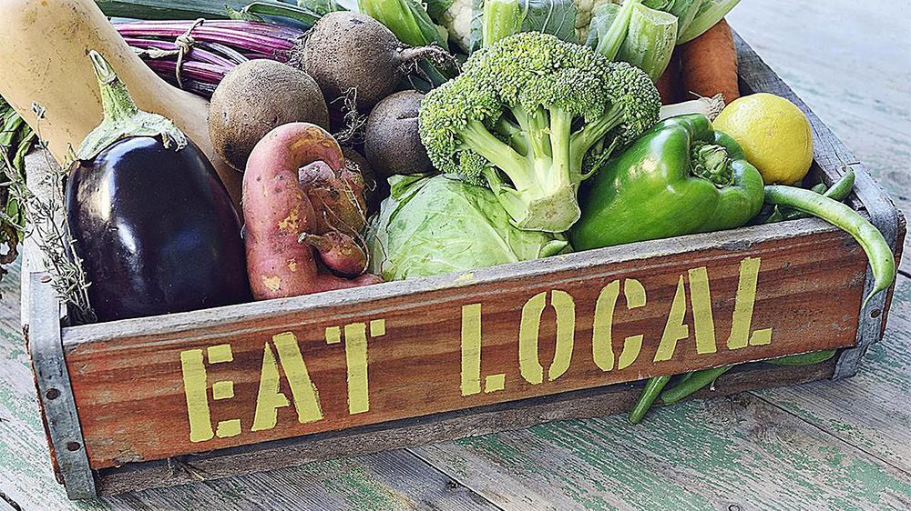
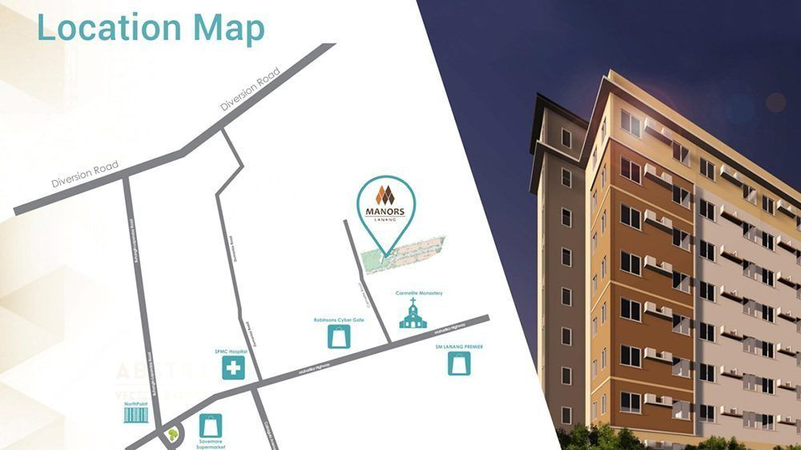

## What is IronHacks?

IronHacks is a global virtual open data hacking program that empowers programmers - from beginners to professionals - to solve civic challenges during a multi-phase and learning-oriented process.  The IronHacks platform offers participants a no-set-up programming environment and many powerful features to create novel and useful models and visualizations that help citizens and governments to make better decisions.

## Example challenges

### HEALTHY LIVING

Use open data and develop an app that helps citizens in finding cheap and seasonally fresh vegetables from local markets.

### AFFORDABLE HOUSING

Build a website with interactive visualizations that helps new students in finding safe and affordable housing near their university.

### WORKFORCE ANALYTICS

Use workforce data to explore factors that affect successful career paths.

---

## The IronHacks process

During an iterative multi-phased process, the competing participants have access to tutorials, standardized libraries and packages, and virtual help sessions. After each phase, submissions are being evaluated within a few hours days with the help of machine intelligence and human experts. Real time and targeted feedback accelerate learning and facilitate participants in hacking complex problems.

## Our Impact

Since 2015, thousands of participants have hacked in parallel virtually around the globe gaining valuable experience in coding as well as work for the chance to win internships, Amazon gift cards, cool swag, and certificates. In addition to the students participation and learning, IronHacks provide the opportunity to do research on open innovation contest processes.

#### Innovation Impact

Participants developed novel and useful open data solutions in an interactive environment. The platform's features helped them continuously improve their submissions while learning from real-time feedback and others participating in the hack.

#### Globalization Impact

A new virtual movement of hacking has emerged at Purdue and beyond. Participants come from the U.S., Colombia, and China. Virtual setting encourages a more diverse audience.

#### Scientific Impact

The scientific team at Purdue generated new knowledge and technologies on the implications of machine-enabled feedback and transparency on participant's productivity and innovation performance.

## Watch and read more about IronHacks

## About IronHacks

[Presentation](https://www.slideshare.net/RCODI/purdue-unal-iron-hacks-2018-spring-award-ceremony)

[Flyer](https://rcodi.org/wp-content/uploads/2018/04/Final-general-flyer_2018_v.01.png)

[Connect with us](https://www.facebook.com/OpenDigitalPurdue/)

## Are you interested in participating as:

### Hackers

[Sign up](http://www.ironhacks.com) to participate in IronHacks or contact us for next hacks.

### Partners

[Email us at](mailto:sbrunswi@purdue.edu)

### Researchers

Are you interested in behavioral computing? Are you interested in understanding the experimental framework on open innovation contests?
